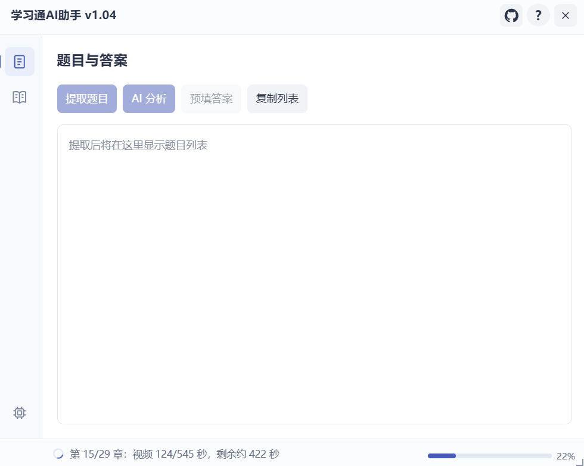
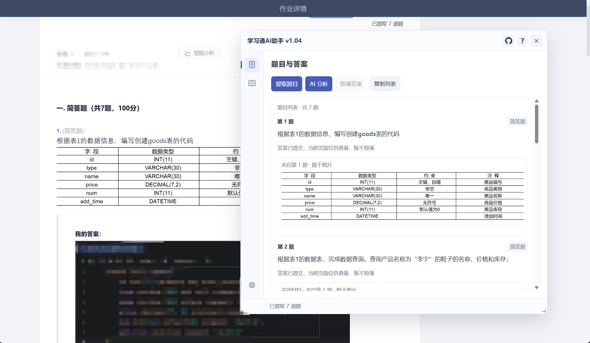
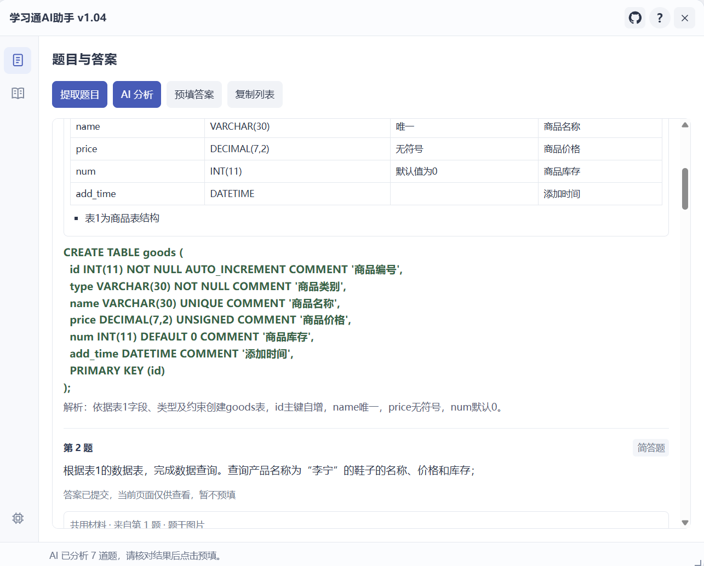
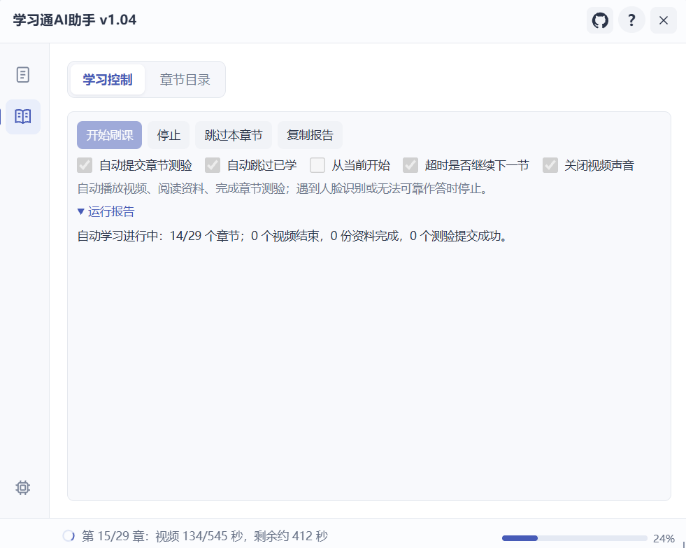
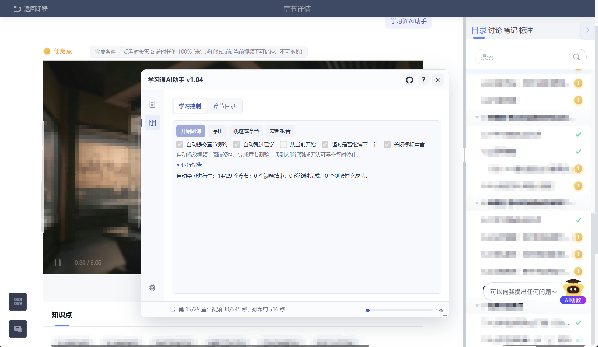
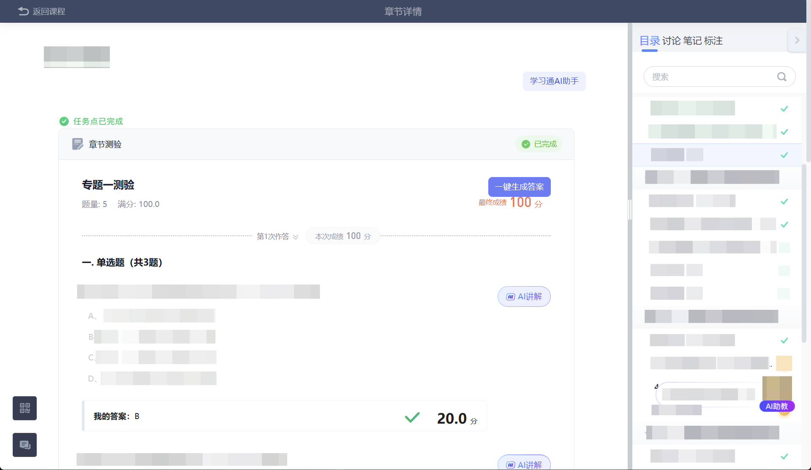

  

# 学习通AI助手

**Chaoxing AI Assistant** · 免费的学习通网页端辅助脚本，配合篡改猴（Tampermonkey）使用。

支持章节测验与课程作业的题目提取、图片识别、AI 分析和答案预填，以及视频、PPT 资料与章节测验的自动学习。提供章节目录、视频进度、模型设置和可保存的学习开关；窗口可拖动与调整大小。

## 程序预览

| 题目与答案 | 题目图片 |
| :---: | :---: |
|  |  |
| **AI 答案与解析** | **自动刷课** |
|  |  |
| **视频进度** | **AI一键答题** |
|  |  |

## 安装与使用

**[点击一键安装 / 更新脚本](https://github.com/zhu-hailin/chaoxing-ai-assistant/raw/HEAD/%E5%AD%A6%E4%B9%A0%E9%80%9AAI%E5%8A%A9%E6%89%8B.user.js)**

1. 安装并启用 [篡改猴（Tampermonkey）](https://www.tampermonkey.net/)，点击上方链接确认安装或更新，然后刷新学习通页面。
2. 打开「学习通AI助手」，在「设置 → 模型设置」保存自己的 DeepSeek API Key。图片题需选择支持图片的模型。
3. 测验或作业使用「一键生成答案」，核对结果后保存或提交；课程学习页面进入「自动刷课」，按需调整开关后开始。

未弹出安装页时，可打开 [完整脚本](学习通AI助手.user.js)，复制到篡改猴编辑器并保存。

## 版本更新

每个版本的更新内容与独立脚本下载，请前往 **[GitHub 发行版](https://github.com/zhu-hailin/chaoxing-ai-assistant/releases)** 查看。实际的程序截图会随着版本更新而发生改变。

## 使用说明

- AI 结果需自行核对；支持范围取决于页面结构和模型能力，人脸识别、验证码及无法处理的任务需人工操作。
- 课程完成状态以平台为准，跳过或超时不会计为完成。
- API Key 与学习开关保存在油猴存储中；更新后请刷新整个课程页面。

## 免费与反馈

**脚本完全免费，无需购买或付费解锁。** AI 功能需要自行准备 API Key，模型服务商可能收取调用费用。本项目不出售 API Key，请勿冒充本项目售卖。请勿二次修改此项目进行售卖。

本项目是第三方工具，与超星、学习通及 DeepSeek 官方无隶属关系。字体解密基于 wyn665817 的「超星字体解密」脚本，保留原作者署名与 MIT 许可。

喜欢这个项目，麻烦点亮 ⭐；问题与建议请提交 [Issue](https://github.com/zhu-hailin/chaoxing-ai-assistant/issues)。
