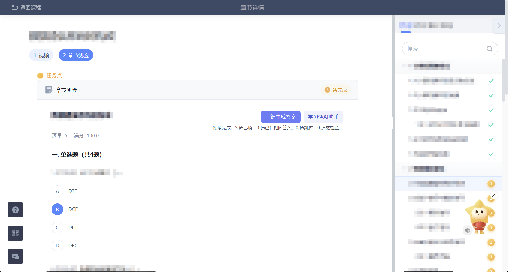
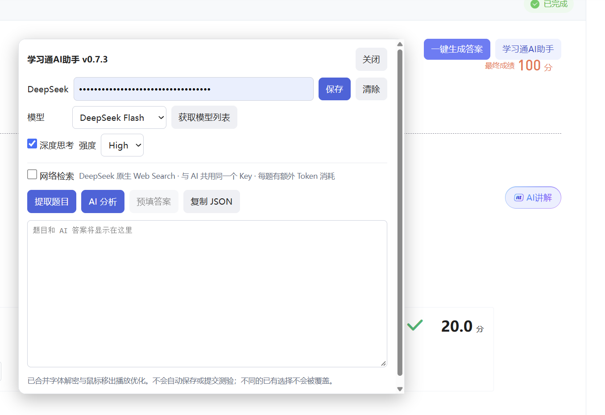
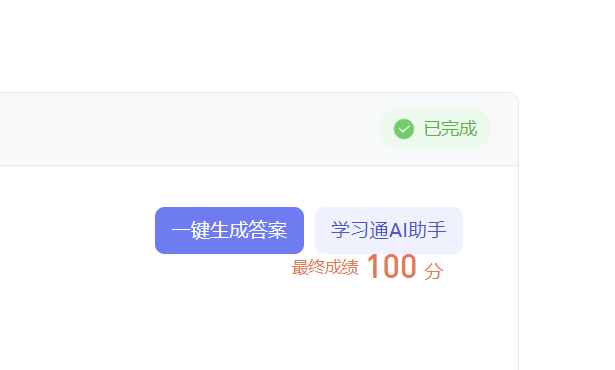

  

## 程序截图

**一键生成答案与预填**

**助手设置面板**

**测验结果示例**

截图来自早期版本，用于展示使用流程；当前版本的界面已更新。

# 学习通AI助手

**Chaoxing AI Assistant** · 免费的学习通网页端学习辅助脚本

配合篡改猴（Tampermonkey）使用，将超星字体解密、视频后台播放优化和 DeepSeek AI 助手整合在一起。支持提取章节测验题目、生成答案与解析、一键预填，以及查看课程目录和已记录的测验成绩。

当前脚本版本为 **v1.03**，仅支持 **DeepSeek**。本项目仅供参考与学习，AI 答案需要自行核对。

## 功能介绍

| 功能 | 说明 |
| --- | --- |
| 一键生成与预填 | 依次完成字体处理、题目提取、AI 分析、校验和预填，显示加载状态及批次进度。 |
| 多题分批分析 | 支持当前页面已加载的全部题目，每批最多 10 题，长题自动拆为更小批次；所有批次成功后统一预填。 |
| 题目与答案列表 | 提取后显示题干和选项，生成后补充对应答案与解析，支持复制可读列表。 |
| DeepSeek 设置 | 支持获取模型列表、切换模型、深度思考、推理强度和联网检索。 |
| 课程目录 | 默认收起，点击侧栏图标向左展开；支持搜索、展开收起、当前章节标记和点击跳转。 |
| 完成状态与成绩 | 显示页面提供的完成状态及待完成任务数；测验成绩仅展示实际读取并记录过的分数。 |
| 可拖拽窗口 | 视频、资料及测验页均可打开助手，按住标题栏空白处拖动窗口。 |
| 字体解密 | 处理混淆题干和选项；无法可靠还原时停止分析并提示错误。 |
| 视频后台播放优化 | 处理鼠标移出学习页导致的暂停，保留手动播放和暂停控制，不会自动启动视频。 |

支持单选、多选、判断及单个文本框填空。预填会保留不同的手工答案和非空填空内容；遇到未知题型、无效选项或不确定的控件时停止分析或跳过预填。脚本不主动点击保存或提交。

## 安装与使用

1. 在浏览器中安装篡改猴（Tampermonkey）。
2. 打开 [脚本文件](学习通AI助手.user.js)，将完整代码粘贴到篡改猴的新建脚本编辑器中并保存。更新旧版时，在原脚本编辑器中替换代码。
3. 刷新学习通课程页面，点击「学习通AI助手」，填写并保存自己的 DeepSeek API Key，选择模型及其他设置。
4. 进入章节测验，点击「一键生成答案」。等待分析与预填完成后，核对答案和跳过项，再自行决定是否保存或提交。

视频或资料页可以打开设置与课程目录；没有测验题目时，提取和分析按钮不可用。独立测验页保留自身的助手入口。

Key 保存在油猴脚本存储中，不显示在题目列表及复制内容中。当前脚本名称为「学习通 AI 助手」，namespace 和存储键沿用旧值；在原脚本编辑器内更新可继续使用原设置。如果被安装为新脚本，可能需要重新填写设置。

## 免费说明

**本工具免费使用，无需购买、订阅或付费解锁。** 请勿二次售卖，也请勿冒充本项目官方售卖。如果发现有人将本工具作为收费商品销售，请向相关平台举报。

AI 功能需要自行准备 DeepSeek API Key。模型调用及联网检索可能由服务商单独计费，这部分费用不是脚本收费。本项目不出售 API Key，也不提供收费题库服务。

## 说明

实际运行可能受到页面版本、浏览器扩展和网络环境的影响。课程目录中的分数仅来自已经读取过的测验结果，没有记录的章节不显示分数，也不会根据完成标记推断成绩。

本项目与学习通公司无关，属于第三方脚本。验证范围与运行记录见 [验证记录](docs/验证记录.md)。

## 致谢与反馈

字体解密部分基于 wyn665817 的「超星字体解密」脚本，相关 MIT 许可与原作者署名保留在脚本内。

如果您喜欢这个项目，请点亮一颗 Star，感谢支持。有问题欢迎提交 [Issue](https://github.com/zhu-hailin/chaoxing-ai-assistant/issues)。
