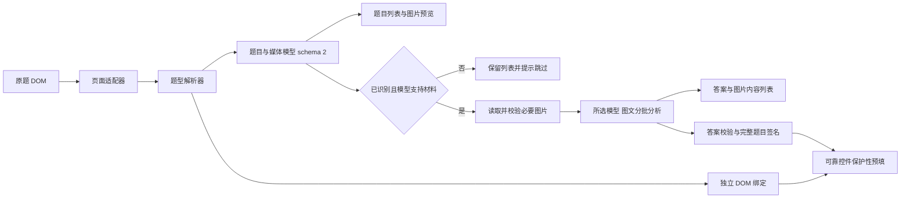

# v1.04 本地解析架构

本版本仅在 `D:\Project\xuexitong` 开发，版本保持 v1.04，npm 包保持 1.0.4。没有修改 GitHub 发布检出，没有新增 AI 题型识别请求；题型识别使用本地页面适配与规则解析。



## 文件与调用关系

| 文件 | 职责 |
| --- | --- |
| `sources/question-parser.js` | 页面适配、前缀题型标签、统一题目模型、题组与媒体描述、独立控件绑定。 |
| `sources/question-media.js` | 图片读取、格式及尺寸检查、请求体组装、视觉能力判断、图片内容解析校验。 |
| `sources/assistant-core.js` | 提取与乱码检查、签名、DeepSeek 请求、答案校验、预填。 |
| `implementation.js` | 控制器、列表与图片展示、分批与运行状态、作业及章节工具条定位。 |
| `sources/panel-template.html` | 面板及列表样式、图片比例、可横向滚动的图片表格。 |
| `build_script.py` | 按 core → parser → media → catalog → implementation 构建单个油猴脚本。 |
| `tests/parser-dom.cjs` | 作业、原生控件、未知题、插件与不可靠绑定的回归验证。 |
| `tests/media-dom.cjs` | 脱敏作业 DOM、题组图片、模拟媒体与模型请求、列表和工具条验证。 |

```js
registerPageAdapter({ id, collect(doc), read(node, index) });
registerQuestionParser({ id, match(raw), parse(raw) });
readQuestionTypeLabel(node, stem, group);
stripQuestionPrefix(text, typeLabel);
collectQuestionMedia(node, stem, questionId, groupId, optionTargets);
collectRawQuestions(doc = document); // RawQuestion[]，包含内部 DOM 绑定
parseQuestionDocument(doc = document); // {schemaVersion:2, questions, media, bindings}
extract(doc = document); // {version:'1.04', schemaVersion:2, total, questions, media}
```

适配器先收集可靠题目边界，再由题型解析器生成类型与能力。识别顺序为明确题型属性 → 题干开头标签 → 所属 `.mark_item > .type_tit` → 原有结构推断 → unknown。标签支持 `【简答题】`、`[简答题]`、`(简答题)`、`（简答题）`，允许前面的题号；普通公式括号不作为题型。题干去掉开头题号与标签，标签保留在 `source.typeLabel`。

## 统一题目与图片模型

```js
{
  id:'q1', number:1, type:'essay', // single / multiple / judge / blank / essay / unknown
  question:'根据表1编写创建 goods 表的代码',
  options:[],
  groupId:'work-group-1',
  imageIds:['img-q1-stem-q-1'],
  contextImageIds:[],
  source:{adapter:'chaoxing-homework', parser:'declared-type', typeLabel:'简答题', inferred:false},
  controls:{/* 选择控件、文本框、富文本等摘要 */},
  capabilities:{analyze:true, prefill:true}, diagnostics:[]
}

// media：资源地址仅用于本地读取，不原样发送 AI
{
  id:'img-q1-stem-q-1', groupId:'work-group-1',
  sourceQuestionId:'q1', sourceQuestionNumber:1,
  location:'stem', optionKey:null, src:'完整资源地址', alt:''
}
```

`bindings` 是以题目 ID 为键的 Map，包含题目节点、文本框、选项控件、图片节点与 writer，不进入序列化、复制内容或 AI 请求。内部模型版本为 2，与脚本 v1.04 无关。

图片仅从确认的题干和选项内容节点提取，不扫描整个题目容器。答案区 `dl`、“我的答案”、正确答案、批语、附件和编辑器工具栏排除。资源优先读取 `data-original`、`data-src`，然后取 `currentSrc/src`；相对地址按原题文档解析。图片 ID 由题目 ID、位置、选项键和顺序组成。

`.mark_item` 是作业题组边界。同组其他题的**题干图片**进入 `contextImageIds`，选项图片只供本题使用；无可靠题组时每题独立，不能把全页图片混在一起。已知题型有正文或图片材料即可分析，图片不使未知题型自动变为简答题。

## 页面适配与作业工具条

- 章节适配器收集 `.singleQuesId`，排除 `.fanyaMarking_left` 中的作业题。
- 作业适配器明确支持 `.fanyaMarking_left .questionLi.singleQuesId`，保留原 `.TiMu`、`.question-item[data-question-id]`、`[data-questionid]` 适配。
- 题干包括原 `.Zy_TItle` 等节点及实际作业 `h3.mark_name`；题干图片位于 `.qtContent.workTextWrap` 内。
- 嵌套容器去重和重复题目 ID 保护继续保留。

工具条优先使用 `.fanyaMarking_left > .detailsHead` 与 `h2.mark_title`。创建正常 flex 标题行，沿用原标题内边距；标题在左，工具条在右，成绩 `.resultNum` 移入操作区的独立行并取消该处绝对定位。原题量、时间及智能分析保留。窄屏允许换行；既有工具条复用，容器替换后重新挂载。章节继续使用原可靠测验标题；降级位置为首个解析后的题目绑定节点之前，不挂在 body 右上角。

## 所选模型与媒体请求

```js
modelSupportsImages(selectedModel); // 已确认支持的 Flash 名称
resolveQuestionModel(selectedModel); // 原样返回，绝不自动切换模型
prepareQuestionMedia(media, report, checkCurrent, doc); // Promise<Map<id, PreparedMedia>>
toAIQuestion(question); // 仅发送必要题目字段
buildChatContent(questions, evidence, preparedMedia); // 纯文本字符串或图文内容数组
buildSearchContent(question, preparedMedia); // Anthropic 兼容图文内容块
```

按用户后续决定，**不采用图片题自动切换 Flash 的方案**。严格使用已选择模型：目前视觉能力名单为 `deepseek-flash`、`deepseek-v4-flash`、`deepseek-v4-flash-vision-exp`；其他模型不分析带自身或共用图片的题目，在列表中说明跳过原因，纯文字题继续分析。不会修改已保存的模型设置。未知或新增模型按无已确认视觉能力处理，需后续验证后适配。

图片读取仅在启动分析后进行。`data:` 解码，`blob:` 和同源图片由原文档 fetch；超星跨域资源用独立 GM GET、`arraybuffer` 响应、30 秒超时。媒体 GET 不带 API Bearer 或 `x-api-key`。连接声明仅增加 `self`、`chaoxing.com`，保留 `api.deepseek.com`，不用 `*`。检查最终地址、状态、文件魔数、浏览器解码及尺寸；HTML 登录响应、空文件、坏图片和不支持格式均报错。

同一运行对相同资源地址共享 Promise，最多两次并发下载；同一请求相同图片内容只发送一次。图片字节、摘要和 Base64 仅保留在当前运行内存，既不写油猴存储也不写日志。模型接收 Base64 内容及图片 ID、来源题号和允许引用题目清单，不接收原始图片 URL、页面地址、登录参数或 HTML。

沿用官方 Chat Completions，图片使用 `image_url` 内容块和 `detail:'original'`；开启检索时图片也随原 Anthropic 兼容搜索接口发送，仍验证实际搜索工具与有效来源。纯文字批次保留字符串形式的请求内容。

限制：PNG、JPEG、GIF、WebP，单图 32 MiB、单边 8192 像素；同次达到 15 张图片后单边限 4096，最多 600 张；请求体本地上限 44 MiB。每批最多 10 题、约 12000 个题目文本字符，Base64 不计入文本权重。组合材料超限先拆为小批，单题与必要图片保持完整，单题仍超限则提示题号停止。不限制当前页面已加载的总题数；单道长题完整保留，最终请求体限制仍适用。

模型额外返回 `mediaAnalysis`，按图片 ID 校验，规范化为摘要、表头/行及条目列表，在原图下显示。SQL、代码和分步骤文字保留换行。无法读清表格或缺少条件时要求空答案并说明原因，不能补造字段。解析内容是 AI 输出，需对照原图核对。复制列表包含文字和图片来源，不含 Base64 或原始图片地址。

选择题允许只有选项图片、没有选项正文。`optionContentRoot()` 将原选择控件映射到独立的内容区域，支持章节 `a.after`、单控件的选项容器/label 和唯一 `label[for]`；图片位于 label 外、同一个独立选项容器内也可收集。`collectQuestionMedia()` 先绑定选项图片，再提取题干，避免被包在 `.Zy_TItle` 中的选项成为组内共用材料。多个控件共用且图片无法对应的容器标记诊断，禁止分析和预填。

图片选项增加 `options[].imageIds`（纯文字选项保持原结构），与顶层媒体描述及 `imageManifest.sources.optionKey` 一起传给 AI；联网检索也标明原选项 key。请求内容去重保留全部图片 ID 与选项关联，不按图片发送顺序重编号。界面将图片预览和解析放在对应的 A/B/C/D 行内，复制列表按相同关联排列；只有选项带图也视为图片题，继续受所选模型的视觉能力限制。内部 schemaVersion 仍为 2。

官方依据：[DeepSeek 图像理解](https://api-docs.deepseek.com/zh-cn/guides/vision/)、[Chat Completions](https://api-docs.deepseek.com/api/create-chat-completion/)、[Tampermonkey 请求](https://www.tampermonkey.net/documentation.php?q=GM_xmlhttpRequest)。

## 标题栏与三页导航

`sources/panel-template.html` 定义固定顶部标题栏、左侧窄图标导航及三个互斥的内容页：`view-model`、`view-questions`、`view-chapters`。模型配置和题目操作分开，原课程目录改为章节页内容，不再展开额外目录栏或改变窗口宽度。导航按钮只显示内联 SVG，名称保留在 `title` 与 `aria-label`；使用 tablist/tab/tabpanel 语义。

`implementation.js` 的 `initPanelNavigation()` 注册点击、上下键、Home/End；`switchPanelView(view, {focus})` 统一维护页面可见性、选中状态和键盘焦点。导航 DOM 顺序为题目、章节、模型，模型按钮通过 `margin-top:auto` 固定在左栏底部。默认题目页，提取/分析进入题目页；关闭重开保留所选页。页面节点复用，因此模型输入、结果列表和各自滚动位置不会因切换重建。

`readModelConfiguration()` 从原油猴存储键读取并规范化 Key 与模型，缺省模型沿用 Flash；只有 Key 和模型均非空才视为配置完整。`renderRunState()` 同步题目页「请先配置模型」提示，保存、清除或选择模型后即时更新。配置入口打开设置页并聚焦所缺字段；`runAnswerFlow()` 在请求前检查固定配置，不完整时打开设置并停止，提取题目和目录查看不依赖模型配置。该检查不发送 API 请求验证 Key。

`course_catalog.js` 的 `initCourseSidebar()` 保留名称，只负责目录初始化、搜索、刷新和观察；目录显示由三页导航控制。运行中允许浏览三个页面，配置修改、生成、预填及章节跳转继续锁定。底部全局状态与小圆环始终可见，标题栏继续拖拽；内容区按可用高度收缩并在当前页面内部滚动。GitHub 和介绍仍在标题栏，介绍使用窗口内覆盖层，不新增第四个导航项。

## 控制器与预填保护

```text
锁定配置与 busy → 字体解密 → 提取并展示题目及图片
→ 保存完整签名 → 跳过所选模型不能分析的题目
→ 读取必要图片（preparing-images）→ 分批、可选检索、图文分析
→ 答案校验与列表展示 → 重新解析并核对签名 → 保护性预填
→ finally 恢复控件和圆形加载状态
```

签名包含 ID、题干、题型、选项、来源、控件能力、题组、图片有效地址、顺序及引用关系。图片或题组变化也会中止结果应用；已有答案值与图片加载状态不纳入签名。

未知题型继续保留列表与诊断，不请求模型、不预填。简答仅支持可靠对应的单个可编辑普通文本框；只读、富文本或多个文本框可以分析但跳过预填。不同的已有选项和非空文字保留。普通分析/预填不点击保存或提交，也不构造测验提交请求；平台自身控件事件可能触发原有行为。新增自动课程模式复用这些保护，只有整份章节测验均可可靠填写时，按用户授权操作原提交按钮；具体控制器和边界见 [自动课程架构](自动课程架构.md)。

已确认的作业查看路由 `/work/view` 中，白色作业卡片内没有可编辑文本框的简答/填空题显示“答案已提交，当前页面仅供查看，暂不预填”。不单凭文本框缺失推断提交状态；普通作答页保留原控件诊断，可编辑题目仍沿用原有预填保护。

图片读取、请求超限、模型响应或签名校验失败时，保留题目和图片诊断，清除可预填答案与本次图片解析，不使用缺图数据继续生成。所有批次成功后才预填，重复点击仍互斥。

## 扩展与验证

注册适配器/解析器的 ID 必须唯一；unknown 为最后的降级路径，新增未知格式不得直接标记可预填。应基于脱敏实际结构证据添加适配，并补充 DOM 和控件操作测试。

`npm test`：原解析、学习页、图文和三页导航的 **83 项**检查保留（47 + 5 + 10 + 21），新增图片选项 6 项、课程流程 34 项与独立预览交互 3 项，合计 **126 项通过**。报告为 `tests/results.json`、`study-results.json`、`parser-results.json`、`media-results.json`、`course-runner-results.json`、`course-preview-results.json`。构建和交付脚本语法检查通过；自动流程的验证范围见 [自动课程架构](自动课程架构.md)。

实际作业 DOM 与图片边界已只读确认；新布局视觉效果、真实图片下载、真实 DeepSeek 图文回答和平台事件行为尚未现场验收。`tests/build_homework_preview.py` 可构建独立模拟预览，使用合成图片与模拟 API；本轮浏览器连接未能打开该预览，不能据此声称视觉通过。模拟测试不等同于真实调用。

本地备份位于 `backups/v1.04-before-homework-images`。不运行 `prepare_publish.py`，不提交或上传，GitHub 发布检出保持原样。
